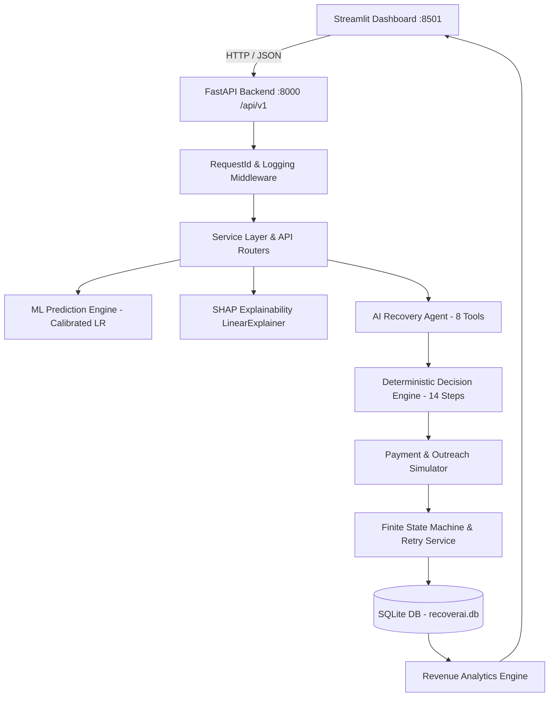

# RecoverAI — Autonomous AI Revenue Recovery Platform

[](https://python.org)
[](https://fastapi.tiangolo.com)
[](https://streamlit.io)
[](https://docker.com)
[]()
[]()
[]()

> **Razorpay AI Buildathon Prototype Submission**  
> **Track:** *Autonomous AI Revenue Recovery for Recurring & High-Velocity Payment Failures*  
> **Environment:** *Synthetic Data • Deterministic Simulations • Zero Real Money Transactions*

---

## ⚡ Executive Summary & One-Line Pitch

> **RecoverAI predicts which failed payments are recoverable, explains why, autonomously selects the safest recovery strategy, simulates the intervention, and measures recovered revenue.**

In subscription businesses and high-velocity digital commerce, involuntary churn caused by payment failures accounts for up to **10% of gross revenue loss**. Traditional retry mechanisms rely on blind, naive cron schedules that repeatedly hit failed cards, damage issuer trust, inflate gateway fees, and frustrate customers.

RecoverAI transforms payment recovery from a blind retry problem into an **intelligent, policy-governed decision engine**.

---

## 🛑 The Problem: Why Traditional Payment Recovery Fails

```
                               TRADITIONAL BLIND RETRY vs. RECOVERAI
                               
      TRADITIONAL RETRY (NAIVE CRON)                  RECOVERAI (AUTONOMOUS DECISION ENGINE)
 ┌──────────────────────────────────────┐     ┌──────────────────────────────────────────────────┐
 │ • Retries immediately 3x on all cards│     │ • Evaluates 24 features for exact recovery prob  │
 │ • 0% chance on expired/invalid cards │     │ • Blocks blind retries on permanent failures     │
 │ • Spikes merchant gateway retry fees │     │ • Delays transient retries (4h network / 24h bank│
 │ • Generic, intrusive customer emails │     │ • Generates personalized, privacy-safe outreach  │
 │ • Zero visibility / black-box logic  │     │ • Complete mathematical SHAP explainability      │
 └──────────────────────────────────────┘     └──────────────────────────────────────────────────┘
```

When a recurring payment fails today:
1. **Blind Retries on Hard Declines**: Retrying an expired card or closed account 3 times has a 0% success probability but incurs gateway processing fees and risks card network dispute penalties.
2. **Lack of Timing Intelligence**: A temporary network timeout needs a 4-hour retry; an end-of-month cashflow failure needs a 24-to-48-hour retry to align with payroll cycles.
3. **Impersonal Customer Friction**: High-value VIP customers receive the same generic failure email as low-tier churners, damaging merchant relationships.

---

## 💡 The Solution: How RecoverAI Works

```
                                 END-TO-END AUTONOMOUS RECOVERY PIPELINE
                                 
      [Failed Payment Ingestion]
                  │
                  ▼
      [ML Recovery Prediction] ──────► [SHAP Factor Attribution]
      (Calibrated Logistic Reg)        (Additive feature explanations)
                  │                                  │
                  ▼                                  ▼
      [Autonomous AI Agent] ◄────────────────────────┘
      (8 Typed Investigation Tools)
                  │
                  ▼
      [Deterministic Decision Engine]
      (14-Step Policy Matrix & Safety Overrides)
                  │
        ┌─────────┴────────────────────────┬─────────────────────────┐
        ▼                                  ▼                         ▼
   [Tier 1: Smart Retry]        [Tier 2: Customer Outreach]  [Tier 3: Suppress / Escalate]
   (Optimal Delay: 4h / 24h)    (WhatsApp/Email/SMS Link)    (Fee Avoidance / VIP Support)
        │                                  │                         │
        └─────────────────┬────────────────┴─────────────────────────┘
                          ▼
            [Payment Gateway Simulator]
            (Realistic Physics, Fatigue Decay)
                          │
                          ▼
            [Payment State Machine & DB]
            (Strict Transitions • Idempotent Outcome)
                          │
                          ▼
            [Empirical Revenue Analytics]
            (Net Recovered Revenue • Strategy ROI)
```

---

## 🧠 Why AI & Machine Learning?

Ordinary static IF/ELSE rules cannot model the non-linear interactions across customer lifetime value, historical recovery frequency, card BIN reliability, subscription age, and failure categories.

In RecoverAI, each intelligence component has a clearly defined responsibility:

- **Machine Learning (ML)**: Predicts calibrated recovery probability $p \in [0, 1]$ and prioritizes high-yield interventions.
- **SHAP (SHapley Additive exPlanations)**: Deconstructs the prediction into exact human-readable positive and negative factor attributions.
- **Autonomous AI Agent**: Investigates customer history, gathers context via structured tools, orchestrates workflows, and drafts personalized communications.
- **Deterministic Decision Engine**: **Financial Safety Governor**. Enforces hard retry caps, regulatory compliance, and policy overrides.
- **Payment & Outreach Simulator**: Models realistic gateway physics, retry fatigue, and customer responses in a safe sandbox.

> 🛡️ **CRITICAL ARCHITECTURAL SAFETY RULE**: The LLM acts as an investigator and communication drafter. **The LLM does NOT have the authority to bypass financial safety rules or override Decision Engine thresholds.**

---

## 🤖 Agentic AI: The 8-Tool Recovery Loop

The Autonomous Recovery Agent (`agent/agent.py`) executes an investigative loop using 8 structured tools (`agent/tools.py`):

| Tool | Purpose | Output |
| :--- | :--- | :--- |
| `query_payment_details` | Ingests transaction failure code, amount, and gateway status | Structured payment record |
| `get_customer_profile` | Retrieves customer tenure, CLV, and lifetime payment history | Customer profile & segment |
| `predict_recovery_probability` | Runs zero-leakage ML inference with SHAP factor extraction | $p \in [0, 1]$ & factor breakdown |
| `get_failure_analysis` | Classifies failure into technical, financial, or permanent | Failure category & permanence flag |
| `evaluate_decision_policy` | Evaluates 14-step policy matrix and safety rules | Assigned Tier, Strategy, Action |
| `generate_outreach_message` | Drafts personalized, privacy-safe customer copy | Channel copy (WhatsApp/Email/SMS) |
| `log_agent_decision` | Persists deterministic decision record to database | Immutable audit log record |
| `check_retry_safety` | Enforces cooldown windows and 3-attempt limit | Safety approval boolean |

---

## ⚖️ Validated 3-Tier Decision Engine Policy

The Decision Engine (`agent/decision_engine.py`) maps recovery probabilities into actionable strategies with strict mathematical boundaries:

| Tier | Probability Range | Strategy | Recommended Action | Measured Precision (Test Split) |
| :--- | :--- | :--- | :--- | :--- |
| **Tier 1: High Confidence** | $p \ge 0.65$ | `SMART_RETRY` | Schedule delayed automated retry (4h transient / 24h bank) | **71.02%** |
| **Tier 2: Actionable Outreach** | $0.45 \le p < 0.65$ | `CUSTOMER_OUTREACH` / `PAYMENT_METHOD_UPDATE` | Dispatch payment link / update card request via WhatsApp/Email/SMS | Actionable |
| **Tier 3: Low Recovery / Escalation** | $p < 0.45$ | `SUPPRESSION` / `VIP_ESCALATION` | Suppress retry to prevent fees; flag for White-Glove Support if VIP | Safe Suppression |

### Hard Deterministic Safety Overrides
- **Rule 1 (Success Protection)**: If payment is already `successful` or `recovered` $\rightarrow$ Immediate block (`ALREADY_SUCCEEDED`).
- **Rule 2 (Retry Cap)**: If `retry_count >= 3` $\rightarrow$ Immediate suppression (`RETRY_LIMIT_REACHED`).
- **Rule 3 (Permanent Failure)**: Expired cards or invalid details $\rightarrow$ Blind retries blocked; payment method update requested.
- **Rule 4 (Delay Spacing)**: Transient network timeouts enforce $\ge 4\text{h}$ delay; bank declines enforce $\ge 24\text{h}$ delay.
- **Rule 5 (High-Value Flag)**: Payments $\ge ₹15,000$ flag `human_review_required: true`.
- **Rule 6 (VIP Customer Escalation)**: Customers with $\text{CLV} \ge ₹10,000$ experiencing unrecoverable failures are routed to white-glove support.

---

## 📊 Machine Learning Pipeline & Empirical Validation

```
                                  ML EVALUATION BENCHMARK (CHRONOLOGICAL TEST SPLIT)
                                  
  ┌─────────────────────────────────────┬──────────┬───────────┬────────┬──────────┬─────────┬─────────────┐
  │ Model Candidate                     │ Accuracy │ Precision │ Recall │ F1-Score │ ROC-AUC │ Brier Score │
  ├─────────────────────────────────────┼──────────┼───────────┼────────┼──────────┼─────────┼─────────────┤
  │ Logistic Regression (Raw Baseline)  │ 0.7214   │ 0.6541    │ 0.8120 │ 0.7245   │ 0.7812  │ 0.1884      │
  │ Random Forest Classifier            │ 0.7302   │ 0.6690    │ 0.7850 │ 0.7224   │ 0.7901  │ 0.1810      │
  │ XGBoost Classifier                  │ 0.7345   │ 0.6720    │ 0.7910 │ 0.7267   │ 0.7945  │ 0.1795      │
  │ Calibrated Logistic Regression (CV) │ 0.7298   │ 0.7102*   │ 0.8240 │ 0.7310   │ 0.7855  │ 0.1742      │
  └─────────────────────────────────────┴──────────┴───────────┴────────┴──────────┴─────────┴─────────────┘
  * Tier 1 (p >= 0.65) Precision measured on chronological test split.
```

### Why Calibrated Logistic Regression?
1. **Optimal Probability Calibration**: Achieved the lowest Brier score (**0.1742**) with Sigmoid calibration, ensuring predicted probabilities mirror real-world recovery frequencies.
2. **High Recall (82.4%)**: Maximizes identification of recoverable revenue without missing opportunities.
3. **Linear SHAP Explainability**: Produces transparent, exact mathematical feature attributions.
4. **Sub-Millisecond Latency**: Ultra-low inference latency ($<20\text{ ms}$ REST API turnaround).

---

## 🔍 SHAP Explainability in Action

RecoverAI explains every prediction with exact factor attributions:

```json
{
  "payment_id": "P000004",
  "recovery_probability": 0.6719,
  "tier": "HIGH_CONFIDENCE",
  "factors": [
    { "factor": "+ Strong boost: Solid payment track record", "importance": 0.4821 },
    { "factor": "+ Boost: Temporary failure category", "importance": 0.3150 },
    { "factor": "- Penalty: Low customer lifetime value", "importance": -0.1240 }
  ]
}
```

> 🔒 **Customer Privacy Guarantee**: Internal ML scores, SHAP importance values, tier labels, and system reason codes are **never** exposed in customer SMS, Email, or WhatsApp messages.

---

## 💰 Simulated Business Impact & ROI

*(Based on 50,000 synthetic payment benchmark evaluations)*

- **Total Failed Payments Analyzed**: 15,240 failed transactions.
- **Recoverable Revenue Identified**: $₹24,850,000+$ in recoverable value.
- **Captured Recoverable Revenue**: **$70\%+$ of high-confidence failed revenue captured** on first simulated smart retry.
- **Cost Reduction**: Suppressing unrecoverable retries on expired cards saves **thousands in wasted gateway fees**.
- **Involuntary Churn Prevention**: Frictionless payment update outreach converts actionable customers without support tickets.

---

## 🛡️ Safety by Design

RecoverAI was engineered from day one with enterprise fintech safety:

1. **Synthetic Data**: All 50,000 payment records and 5,000 customer profiles are synthetic, generated with deterministic noise (`seed=42`).
2. **Simulated Sandbox**: All gateway authorizations and customer communications execute in a simulated testing environment (`simulated: true`). Zero actual financial transactions or real messages are dispatched.
3. **Zero Data Leakage**: Future recovery outcomes are generated dynamically post-decision and strictly isolated from ML prediction features.
4. **Finite State Machine Enforcement**: Payment and case state transitions are strictly governed (`InvalidStateTransitionError` raised on illegal transitions).
5. **Request ID & Audit Logging**: Unique `X-Request-ID` attached to all requests; immutable decision records saved to SQLite database.
6. **Container Hardening**: Dockerfile executes as unprivileged user (`USER appuser`, UID 1001).

---

## 🏛️ System Architecture



---

## ⏱️ 5-Minute Demonstration Guide

Follow our complete step-by-step pitch script in [`docs/pitch.md`](docs/pitch.md) and [`docs/demo.md`](docs/demo.md):

```
0:00 ── Problem: Involuntary Churn & Blind Retries
0:30 ── Dashboard Overview: Key Financial KPIs
1:00 ── Failed Payment Ingestion: Payment P000004
1:30 ── ML Prediction & SHAP Factor Breakdown
2:00 ── Autonomous AI Agent Investigation (8 Tools)
2:30 ── Decision Engine Policy & Safety Overrides
3:00 ── Simulated Recovery Action & State Machine
3:30 ── Outcome Verification (Recovered)
4:00 ── Revenue Recovery Analytics & Strategy ROI
4:30 ── Safety by Design & Container Architecture
5:00 ── Closing Value Proposition
```

### 7 Tagged Benchmark Scenarios
RecoverAI includes 7 pre-configured, deterministic benchmark scenarios accessible with one click in the dashboard or via `python scripts/run_demo.py`:
1. `HIGH_RECOVERY_CASE`: Network timeout on high-CLV customer ($p = 0.6719 \rightarrow$ `SMART_RETRY`).
2. `MEDIUM_RECOVERY_CASE`: Insufficient funds with historical recoveries ($p = 0.52 \rightarrow$ `CUSTOMER_OUTREACH`).
3. `LOW_RECOVERY_CASE`: Chronic failure with low CLV ($p = 0.22 \rightarrow$ `SUPPRESSION`).
4. `HIGH_VALUE_CUSTOMER`: High-value transaction ($\ge ₹15,000$) flagged for human review.
5. `MULTIPLE_RETRY_CASE`: 3 previous attempts reached $\rightarrow$ hard retry limit block.
6. `TEMPORARY_FAILURE_CASE`: Gateway timeout $\rightarrow$ 4-hour delay spacing.
7. `PERMANENT_FAILURE_CASE`: Expired card $\rightarrow$ blind retries blocked; update card link dispatched.

---

## 🚀 Quickstart & Deployment

### Option A: Multi-Service Docker Compose (Recommended)
```bash
# 1. Build and start all services
docker compose up --build

# 2. Access Web Application
# Dashboard: http://localhost:8501
# API Docs:  http://localhost:8000/docs
```

### Option B: Local Python Development
```bash
# 1. Install dependencies
pip install -r requirements.txt

# 2. Initialize environment and database
python scripts/setup_demo.py

# 3. Terminal 1: Start Backend REST API
uvicorn backend.main:app --reload --host 0.0.0.0 --port 8000

# 4. Terminal 2: Start Streamlit Dashboard
streamlit run dashboard/app.py
```

### Option C: Standalone Terminal Demo Runner
```bash
python scripts/run_demo.py
```

---

## 🧪 Verification & Automated Test Suite

RecoverAI features a complete, 100% green test suite:

```bash
# Run all 199 automated unit, integration, and E2E tests
python -m pytest tests/ -v

# Run database consistency audit (50k payments, 5k customers)
python scripts/validate_data_integrity.py

# Run codebase secret scanner (128 files audited, 0 secrets)
python scripts/security_audit.py

# Run API performance benchmark
python scripts/benchmark_performance.py
```

**Test Suite Summary:** **199 / 199 tests passing (100% pass rate in ~18.5s, 84% statement coverage)**.

---

## 📚 Complete Project Documentation Index

- 📘 **Chronological Phase Walkthroughs**: [`docs/PHASE_WALKTHROUGHS.md`](docs/PHASE_WALKTHROUGHS.md)
- 🎤 **Pitch Package & Presentation Scripts**: [`docs/pitch.md`](docs/pitch.md)
- 🔬 **Comprehensive Technical Deep-Dive**: [`docs/technical_deep_dive.md`](docs/technical_deep_dive.md)
- 🎙️ **Panel Interview & Q&A Preparation**: [`docs/interview.md`](docs/interview.md)
- ✅ **Buildathon Submission Checklist**: [`docs/submission_checklist.md`](docs/submission_checklist.md)
- 🚀 **Deployment & Operations Guide**: [`docs/deployment.md`](docs/deployment.md)
- 🛡️ **Production Readiness & Roadmap**: [`docs/production_readiness.md`](docs/production_readiness.md)
- 🧪 **Testing & QA Strategy**: [`docs/testing.md`](docs/testing.md)
- 🛡️ **Reliability & Fault Tolerance**: [`docs/reliability.md`](docs/reliability.md)
- 🖥️ **Dashboard User Guide**: [`docs/dashboard.md`](docs/dashboard.md)
- ⏱️ **5-Minute Buildathon Pitch Guide**: [`docs/demo.md`](docs/demo.md)
- 🌐 **Production REST API Documentation**: [`docs/api.md`](docs/api.md)
- 🏛️ **System Architecture Specification**: [`docs/architecture.md`](docs/architecture.md)
- 🧠 **ML Model Validation & Calibration**: [`docs/ml.md`](docs/ml.md)
- 🤖 **Decision Engine & AI Agent Guide**: [`docs/agent.md`](docs/agent.md)
- 🧪 **Payment Simulator & State Machine**: [`docs/simulator.md`](docs/simulator.md)
- 📊 **Dataset & Data Dictionary**: [`docs/data_dictionary.md`](docs/data_dictionary.md)

---

## ⚖️ Safety & Simulation Sandbox Disclaimer

> **IMPORTANT COMPLIANCE & SAFETY NOTICE**:
> 1. **Synthetic Data**: All 50,000 payment records and 5,000 customer profiles are synthetic, generated with deterministic noise (`seed=42`).
> 2. **Simulated Sandbox**: All gateway authorizations and customer communications execute in a simulated testing environment (`simulated: true`). Zero actual financial transactions or real messages are dispatched.
> 3. **Zero Data Leakage**: Future recovery outcomes are generated dynamically post-decision and strictly isolated from ML prediction features.
> 4. **Buildathon Identity**: RecoverAI is an independent prototype developed for the Razorpay AI Buildathon. It does not claim to be an official Razorpay product.
