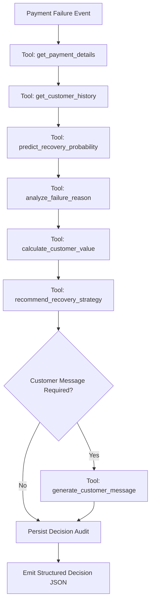

# RecoverAI — AI Recovery Agent & Decision Engine

## 1. Overview & Architecture

RecoverAI features a hybrid autonomous system combining a **calibrated statistical/ML model**, a **deterministic policy decision engine**, and an **orchestrating AI recovery agent**.



---

## 2. Hard Safety Rules & Policy Ownership

Financial and retry actions carry real-world consequences (gateway rate limits, bank interchange penalties, customer churn). Therefore:
- **The LLM does NOT decide whether money should be retried.**
- The **Decision Engine owns 100% of recovery and financial policy**.
- The **AI Agent orchestrates tools and executes workflows**.
- The **LLM generates personalized, empathetic customer messaging** adhering to strict privacy guardrails.

### Safety Rules Matrix

| Rule | Condition | Action Taken | Reason Code |
| :--- | :--- | :--- | :--- |
| **Payment Already Succeeded** | `payment_success == True` or `status == "recovered"` | Blocks all retry/recovery actions | `PAYMENT_ALREADY_RECOVERED`, `RETRY_BLOCKED` |
| **Retry Limit Reached** | `retry_count >= 3` | Suppresses automated retries | `RETRY_LIMIT_REACHED`, `RETRY_BLOCKED` |
| **Permanent Failure Guard** | `expired_card`, `invalid_payment_details` | Blocks blind retry; triggers payment update | `PERMANENT_FAILURE`, `ALTERNATIVE_PAYMENT_RECOMMENDED` |
| **Customer Cancellation** | `customer_cancelled` | Dispatches retention and renewal link | `CUSTOMER_CANCELLED_FLOW`, `RETENTION_INCENTIVE` |
| **Transient Error Spacing** | `network_failure`, `gateway_failure`, `timeout` | Schedules smart retry with 4-hour delay | `TEMPORARY_FAILURE`, `TRANSIENT_NETWORK_FAILURE` |
| **Account Issue Delay** | `insufficient_funds`, `bank_declined` | Schedules smart retry with 24-hour delay | `INSUFFICIENT_FUNDS_DETECTED` |
| **High-Value Transaction** | `amount >= ₹15,000` & $p < 0.65$ | Flags case for human review | `HIGH_VALUE_PAYMENT_REVIEW` |
| **VIP Account Escalation** | `CLV >= ₹10,000` or `Enterprise` & $p < 0.45$ | Escalates to dedicated Account Manager | `VIP_ENTERPRISE_HIGH_TOUCH`, `HIGH_CUSTOMER_VALUE` |

---

## 3. Validated 3-Tier Decision Policy

The recovery engine classifies each payment failure into one of three validated policy tiers:

```
                  ┌──────────────────────────────────────────────┐
                  │          ML Recovery Probability (p)         │
                  └──────────────────────┬───────────────────────┘
                                         │
                 ┌───────────────────────┼───────────────────────┐
                 ▼                       ▼                       ▼
      ┌─────────────────────┐ ┌─────────────────────┐ ┌─────────────────────┐
      │   p >= 0.65         │ │  0.45 <= p < 0.65   │ │     p < 0.45        │
      │  HIGH_CONFIDENCE    │ │ ACTIONABLE_OUTREACH │ │ SUPPRESS_OR_ESCALATE│
      ├─────────────────────┤ ├─────────────────────┤ ├─────────────────────┤
      │ Smart Automated     │ │ WhatsApp / Email    │ │ Suppress / Human CS │
      │ Retry (4h or 24h)   │ │ Payment Link        │ │ or VIP Escalation   │
      │ Precision: 71.02%   │ │ Revenue: 58.05%     │ │ Prevent Waste       │
      └─────────────────────┘ └─────────────────────┘ └─────────────────────┘
```

---

## 4. Standard Decision Schema

Every decision output conforms to the standard RecoverAI schema:

```json
{
  "payment_id": "P1023",
  "recovery_probability": 0.78,
  "tier": "HIGH_CONFIDENCE",
  "strategy": "SMART_RETRY",
  "recommended_action": "RETRY_AFTER_DELAY",
  "delay_hours": 24.0,
  "reason_codes": [
    "HIGH_RECOVERY_PROBABILITY",
    "STRONG_PAYMENT_HISTORY",
    "LOW_RETRY_COUNT"
  ],
  "explanation": "High recovery probability (78.0%), strong payment history, and low retry count support an automated smart retry scheduled in 24 hours.",
  "customer_message_required": false,
  "human_review_required": false
}
```

---

## 5. Agent Tool Layer (`agent/tools.py`)

The agent has access to 8 structured, typed tools:

1. `get_payment_details(payment_id: str) -> Dict[str, Any]`
   - Retrieves payment amount, currency, failure reason, subscription type, and transaction context.
   - Automatically sanitizes post-outcome leakage columns.

2. `get_customer_history(customer_id: str) -> Dict[str, Any]`
   - Fetches customer tenure, lifetime value, transaction count, and historical recovery rate.

3. `predict_recovery_probability(payment_data: Dict[str, Any]) -> Dict[str, Any]`
   - Calls the calibrated Phase 2 ML model with SHAP feature explanations.

4. `analyze_failure_reason(failure_reason: str) -> Dict[str, Any]`
   - Evaluates technical vs customer-intent vs permanent card failure categories.

5. `calculate_customer_value(customer_id: str) -> Dict[str, Any]`
   - Determines monetization tier (`VIP_ENTERPRISE`, `TIER_1_HIGH_VALUE`, etc.).

6. `get_recovery_policy() -> Dict[str, Any]`
   - Exposes active thresholds (`0.65`, `0.45`, `max_retries=3`, `min_delay=4h`).

7. `recommend_recovery_strategy(payment, customer, recovery_probability, context) -> DecisionResponse`
   - Executes deterministic 14-step decision pipeline.

8. `generate_customer_message(decision, customer, payment, channel) -> Dict[str, Any]`
   - Creates personalized, channel-formatted messaging for WhatsApp, Email, or SMS.

---

## 6. Messaging & Privacy Guarantees

### Zero-Leakage Privacy Rule
The customer communication generator adheres to a strict safety constraint:
- **NEVER** expose recovery probabilities (e.g. `0.78`).
- **NEVER** expose ML terminology, SHAP values, risk scores, or internal system jargon.
- Use empathetic, professional language explaining the non-threatening billing issue.

### Deterministic Mock LLM Mode
When running without an OpenAI API key (`OPENAI_API_KEY` unset or in demo mode), the system uses pre-configured deterministic templates guaranteeing 100% offline functionality.

---

## 7. REST API Endpoints

- `POST /recovery/analyze` — Evaluates payment against ML model and decision engine.
- `POST /recovery/agent/run` — Executes the full autonomous agent lifecycle.
- `GET /recovery/{payment_id}/decision` — Returns the latest persisted decision.
- `GET /recovery/{payment_id}/history` — Returns full audit trail of predictions and decisions.
