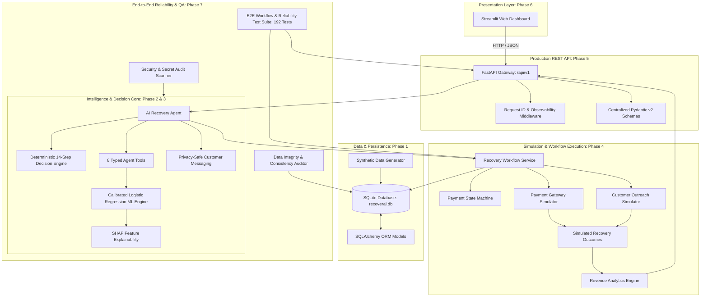

# RecoverAI — Complete System Architecture

## 1. High-Level System Architecture

RecoverAI is structured as an enterprise-grade autonomous AI revenue recovery platform:



---

## 2. Layer Responsibilities & Pipeline

| Layer | Primary Modules | Key Responsibilities |
| :--- | :--- | :--- |
| **Streamlit Presentation** | `dashboard/app.py`, `dashboard/pages/` | Executive KPI cards, 7-page workstation, interactive Plotly visualizations, live demo triggers. |
| **REST API Gateway** | `backend/main.py`, `backend/api/v1/` | Exposes versioned `/api/v1` REST endpoints for customers, payments, agent, recovery, simulation, and analytics. |
| **API Middleware & Schemas** | `backend/middleware.py`, `backend/schemas/` | Attaches `X-Request-ID`, calculates latency headers, enforces pagination limits, and standardizes error responses. |
| **Data & Persistence** | `ml/data_generator.py`, `backend/models/` | 50,000 realistic payments and 5,000 customers with zero leakage columns and indexed relational schemas. |
| **ML Inference & SHAP** | `ml/predict.py`, `ml/explainability.py` | Calibrated recovery probability prediction ($p \in [0, 1]$) with SHAP top-factor attributions. |
| **Decision Intelligence** | `agent/decision_engine.py` | 14-step deterministic policy enforcing validated 3-tier rules, delay spacing, and safety overrides. |
| **AI Agent Layer** | `agent/agent.py`, `agent/tools.py` | Autonomous multi-tool agent orchestrating context retrieval, decision-making, and audit logging. |
| **Simulation Engine** | `simulator/payment_simulator.py`, `outreach_simulator.py` | Deterministic simulation of payment gateways, retry fatigue, and customer response actions (`simulated: true`). |
| **State & Workflow** | `services/state_machine.py`, `recovery_workflow.py` | Enforces payment lifecycle state transitions (`FAILED` $\rightarrow$ `RETRYING` $\rightarrow$ `RECOVERED`) with idempotency. |
| **Revenue Analytics** | `services/analytics.py` | Computes empirical KPIs, strategy benchmarks, failure breakdowns, and time-series trends from real records. |
| **Reliability & Testing** | `tests/`, `scripts/validate_data_integrity.py` | 192 automated tests (100% passing, 84% coverage), data integrity audits, and secret scanning. |

---

## 3. Directory Layout

```
recoverai/
├── agent/
│   ├── __init__.py
│   ├── agent.py              # Autonomous AI Recovery Agent
│   ├── decision_engine.py    # Deterministic 14-step Decision Engine
│   ├── messaging.py          # Privacy-safe Customer Messaging & LLM Layer
│   └── tools.py              # 8 Typed Agent Tools
├── backend/
│   ├── api/
│   │   ├── __init__.py
│   │   ├── analytics.py      # Legacy analytics endpoint alias
│   │   ├── recovery.py       # Legacy recovery endpoint alias
│   │   └── v1/               # Version 1 Production REST API
│   │       ├── __init__.py   # Router aggregator (/api/v1)
│   │       ├── agent.py      # Agent run & batch execution
│   │       ├── analytics.py  # Revenue analytics & trends
│   │       ├── customers.py  # Customer profile & history
│   │       ├── decisions.py  # Historical decision records
│   │       ├── health.py     # Health, liveness, readiness
│   │       ├── ml.py         # ML prediction & status
│   │       ├── payments.py   # Payments & event timelines
│   │       ├── recovery.py   # Recovery policy, queue & workflow
│   │       └── simulation.py # Gateway & outreach simulation
│   ├── models/               # SQLAlchemy ORM models
│   ├── schemas/              # Pydantic v2 schemas
│   ├── config.py             # Centralized settings & thresholds
│   ├── database.py           # Database engine & session maker
│   ├── errors.py             # Standardized error envelopes
│   ├── middleware.py         # Request ID & logging middleware
│   └── main.py               # FastAPI application entry point
├── dashboard/                # Phase 6 Streamlit Fintech Dashboard
│   ├── components/           # Reusable UI cards, tables, charts, timeline
│   ├── pages/                # 7 distinct dashboard views
│   ├── api_client.py         # Type-safe REST client for /api/v1
│   ├── app.py                # Main Streamlit app entry point
│   └── config.py             # Visual styling tokens & palette
├── data/
│   └── synthetic/            # 50,000 synthetic payments & quality reports
├── docs/
│   ├── agent.md              # Agent & Decision Engine documentation
│   ├── api.md                # Production REST API documentation
│   ├── architecture.md       # High-level system architecture
│   ├── dashboard.md          # Streamlit frontend architecture
│   ├── data_dictionary.md    # Complete dataset dictionary
│   ├── demo.md               # 5-minute buildathon demonstration pitch
│   ├── ml.md                 # ML validation, calibration & tier analysis
│   ├── PHASE_WALKTHROUGHS.md # Permanent chronological development record
│   ├── reliability.md        # Fault tolerance, idempotency & state machine
│   ├── simulator.md          # Simulator architecture & state machine
│   └── testing.md            # Complete testing & QA strategy
├── ml/
│   ├── artifacts/            # Model pickle, scaler, metadata, SHAP background
│   ├── explainability.py     # SHAP explainer implementation
│   ├── predict.py            # Real-time inference interface
│   ├── preprocessing.py      # Preprocessing & leakage guards
│   └── train.py              # ML model training pipeline
├── scripts/
│   ├── benchmark_performance.py # Local latency benchmark runner
│   ├── run_demo.py           # Standalone terminal demo script
│   ├── security_audit.py     # Secret and vulnerability scanner
│   ├── validate_data_integrity.py # Database consistency auditor
│   └── verify_phase5_api.py  # Automated REST API verification suite
├── services/
│   ├── __init__.py
│   ├── analytics.py          # Revenue calculation & KPI aggregations
│   ├── recovery_workflow.py  # End-to-end autonomous recovery workflow
│   ├── retry_service.py      # Retry execution service & safety validator
│   └── state_machine.py      # Payment & Case state machine
├── simulator/
│   ├── __init__.py
│   ├── outreach_simulator.py # Customer communication simulator
│   └── payment_simulator.py  # Payment gateway simulator
└── tests/                    # 192 Passing Automated Tests (100% Green)
    ├── test_agent.py
    ├── test_agent_tools.py
    ├── test_analytics.py
    ├── test_api_agent.py
    ├── test_api_analytics_v1.py
    ├── test_api_customers.py
    ├── test_api_decisions.py
    ├── test_api_health.py
    ├── test_api_integration.py
    ├── test_api_middleware_errors.py
    ├── test_api_ml.py
    ├── test_api_payments.py
    ├── test_api_recovery.py
    ├── test_api_recovery_v1.py
    ├── test_api_simulation.py
    ├── test_dashboard_api_client.py
    ├── test_dashboard_components.py
    ├── test_data_generator.py
    ├── test_decision_engine.py
    ├── test_e2e_workflow.py
    ├── test_integration_reliability.py
    ├── test_ml_pipeline.py
    ├── test_recovery_workflow.py
    ├── test_simulator.py
    └── test_state_machine.py
```
