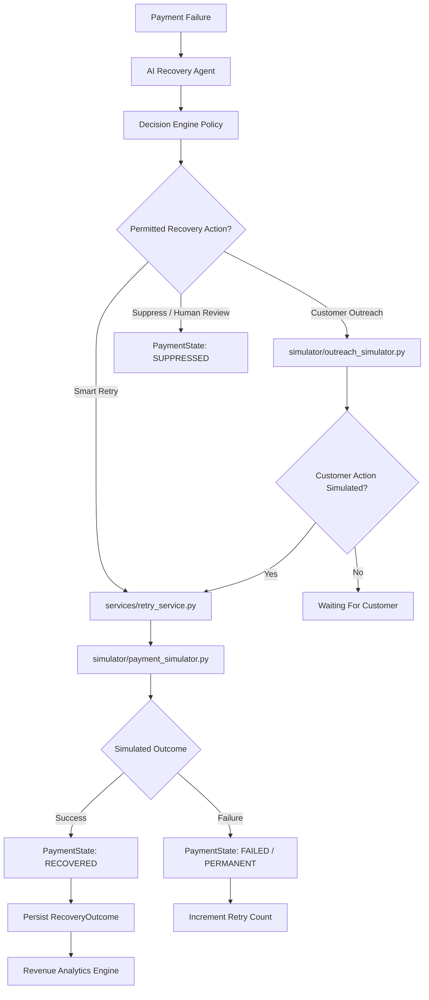

# RecoverAI — Payment & Outreach Simulator Architecture

## 1. Executive Summary

The RecoverAI Simulation & Execution Layer converts intelligent policy recommendations into simulated recovery actions, evaluates realistic probabilistic outcomes without real financial execution, updates transaction lifecycle states, and records empirical revenue recovery metrics.



---

## 2. Payment Gateway Simulator (`simulator/payment_simulator.py`)

### Simulation Mechanics & Factors
The gateway simulator does not generate purely uniform random numbers. Instead, it models realistic transaction authorization dynamics:
- **Base Likelihood**: Grounded in the Phase 2 calibrated recovery probability $p$.
- **Delay Sensitivity**:
  - `insufficient_funds`: 24-hour delay boosts recovery chance; immediate retries (<4h) suffer severe penalties.
  - `network_failure`: 4-hour delay allows transient gateway connectivity to restore.
- **Retry Fatigue Decay**: Success likelihood decays by ~8% on each subsequent retry attempt.
- **Permanent Failure Physics**:
  - `expired_card` / `invalid_payment_details` without a payment method update have **0.0% probability** of retry success.
  - Customer updating card details restores recovery chance to $\ge 88\%$.

### Deterministic Seed Support
Using `seed=42` (configurable), any payment retry attempt hashed with `(payment_id, attempt_number, seed)` reproduces exact, deterministic outcomes across runs.

---

## 3. Payment State Machine (`services/state_machine.py`)

The state machine enforces legal lifecycle state transitions and prevents unauthorized or contradictory status updates.

```
       ┌──────────────┐
       │    FAILED    ├─────────────────────────────┐
       └──────┬───────┘                             │
              │                                     │
              ▼                                     │
    ┌──────────────────┐                            │
    │ RETRY_SCHEDULED  │                            │
    └─────────┬────────┘                            │
              │                                     │
              ▼                                     │
       ┌──────────────┐                             │
       │   RETRYING   │                             │
       └───┬──────┬───┘                             │
           │      │                                 ▼
           │      ├─────────────────────► ┌──────────────────┐
           │      │                       │    SUPPRESSED    │
           │      ▼                       └──────────────────┘
           │ ┌──────────────┐                       ▲
           │ │ PERMANENTLY  ├───────────────────────┘
           │ │    FAILED    │
           │ └──────────────┘
           ▼
    ┌──────────────┐
    │  RECOVERED   │ (Terminal State)
    └──────────────┘
```

### Invalid Transitions Handled:
- `RECOVERED` $\rightarrow$ `RETRYING` (Strictly Rejected with `InvalidStateTransitionError`)
- `RECOVERED` $\rightarrow$ `FAILED` (Strictly Rejected)
- `PERMANENTLY_FAILED` $\rightarrow$ `RETRYING` (Blocked unless payment method updated)

---

## 4. Customer Outreach Simulator (`simulator/outreach_simulator.py`)

Simulates multi-channel communication without dispatching real emails, SMS, or WhatsApp messages.
- **Delivery Rate**: 98% for WhatsApp/SMS, 92% for Email.
- **Customer Engagement**: Simulates whether a customer opens a link or updates credentials based on customer segment, CLV, and communication channel.
- **Downstream Actions**:
  - `PAYMENT_LINK_CLICKED` $\rightarrow$ Triggers auto-recovery payment attempt.
  - `CARD_DETAILS_UPDATED` $\rightarrow$ Unblocks permanent card failure retries.
  - `NO_CUSTOMER_ACTION` $\rightarrow$ Preserves case state pending customer response.

---

## 5. End-to-End Workflow & Idempotency (`services/recovery_workflow.py`)

- **Workflow Function**: `run_recovery_workflow(payment_id, force_fresh=False, seed=42)`.
- **Idempotency Protection**: If a payment has already been marked `recovered_after_failure == True` or a successful `RecoveryOutcome` exists in SQLite, the workflow returns the cached outcome immediately without re-executing retries.
- **Safety Integration**: Never allows retries if `retry_count >= 3`, if retry spacing is $< 4$ hours, or if Decision Engine recommended suppression.

---

## 6. Revenue Analytics (`services/analytics.py`)

Calculates empirical financial KPIs from actual database records:
- **Total Failed Payments Tracked**: Total volume and count of failed transactions.
- **Recovered Value**: Sum of recovered payment amounts.
- **Unrecovered Value**: `Failed Value - Recovered Value`.
- **Recovery Rate**: `Recovered Value / Failed Value`.
- **Strategy & Failure Categorization**: Aggregates recovery rates by `SMART_RETRY`, `CUSTOMER_OUTREACH`, `PAYMENT_METHOD_UPDATE`, etc.

---

## 7. Known Limitations & Safety Guarantees

1. **Zero Real Money**: All payment attempts are marked `simulated: True`.
2. **Zero Real Messages**: All customer outreach is internal simulation only.
3. **No Target Leakage**: The simulator uses the ML predicted probability to generate future outcomes; future outcomes are never fed backward into ML features.
